# 🚖 NYC TLC Trip Data Pipeline (2015–2025) con Mage + dbt + Snowflake

Proyecto de **Data Mining** — Universidad San Francisco de Quito.  
Implementa un pipeline completo de ingesta, transformación y modelado dimensional sobre el dataset **NYC TLC Trip Record Data (Yellow/Green 2015–2025)**.

---

## 📌 Resumen

- **Ingesta**: archivos Parquet 2015–2025 de Yellow y Green, cargados a Snowflake (bronze).  
- **Transformaciones**: arquitectura de medallas (`bronze → silver → gold`) con **dbt**.  
- **Orquestación**: **Mage** en Docker ejecuta pipelines de backfill y transformaciones.  
- **Modelo final (Gold)**: tabla de hechos `fct_trips` y dimensiones conformadas (`dim_zone`, `dim_payment_type`, `dim_ratecode`).  
- **Clustering**: aplicado sobre `fct_trips` en Snowflake (por `pickup_datetime`, `pu_zone_sk`).  
- **Calidad**: validaciones dbt (`not_null`, `unique`, `accepted_values`, `relationships`).  
- **Documentación**: diccionario de datos, auditoría de cargas, tests y notebook de análisis con SQL.  

---

## 🎯 Objetivos de aprendizaje

1. Ingerir datos históricos masivos (2015–2025).  
2. Aplicar arquitectura de medallas (bronze, silver, gold).  
3. Evaluar impacto de **clustering** en Snowflake (Query Profile).  
4. Operar secretos y roles con privilegios mínimos en Mage.  
5. Garantizar calidad con **tests dbt**, auditorías y documentación.  

---

## 🏗️ Arquitectura

```mermaid
flowchart TD
    subgraph Mage["Orquestación Mage"]
        A["generate_months (PY)"] --> B["fetch_and_stage_parquet (PY)"]
        B --> C["snowflake_connection (PY)"]
        C --> D["copy_into_bronze (PY)"]
        C --> E["load_taxi_zones (PY)"]
        D --> BronzeNode["BRONZE.*"]
        E --> BronzeNode
    end

    subgraph Snowflake["Snowflake Layers"]
        BronzeNode["BRONZE schema\n green_raw, yellow_raw, taxi_zones"]
        LookupsNode["LOOKUPS schema\n payment_type_lookup, ratecode_lookup"]
        SilverNode["SILVER schema\n silver_trips (VIEW)"]
        GoldNode["GOLD schema\n dim_zone, dim_payment_type, dim_ratecode, fct_trips"]
    end

    BronzeNode --> Staging["stg_yellow / stg_green (dbt)"]
    LookupsNode --> SilverNode
    BronzeNode --> SilverNode
    SilverNode --> GoldNode
    LookupsNode --> GoldNode

    subgraph Audit["AUDIT Layer"]
        N["sync_coverage_to_audit_py (PY)"]
    end

    GoldNode --> M
```




- **Bronze (raw)**: datos tal cual del Parquet + metadatos de ingesta (`run_id`, `ingest_ts`).  
- **Silver**: estandarización, limpieza, enriquecimiento con Taxi Zones.  
- **Gold**: modelo en estrella con `fct_trips` y dimensiones conformadas.  
- **Orquestación**: pipelines Mage para ingesta mensual y transformaciones dbt.

### Diagrama orquestacion


---

## 📂 Cobertura (2015–2025)

Matriz de cobertura por año/mes y servicio (Yellow/Green).  
Se documenta si un mes carece de archivo Parquet oficial.

📸 Evidencia: Revisar en docs coverage_matrix.csv

---

## ♻️ Backfill mensual e idempotencia

**Meta**: cargar por particiones naturales (`service_type`, `year`, `month`) y poder reintentar cualquier mes sin duplicados.

### 🔑 Bloque clave: `copy_into_bronze (PY)`

- Crea tablas si no existen (`BRONZE.yellow_trips`, `BRONZE.green_trips`) y asegura columnas recientes.  
- **Idempotencia por partición**: antes de insertar, elimina datos previos:

```sql
DELETE FROM <DB>.<SCHEMA_RAW>.<service>_trips
WHERE year = :year 
  AND month = :month 
  AND service_type = :service;
```

- Descarga Parquet, lee por row groups y sube en micro-batches (`write_pandas`).  
- Normaliza fechas de pickup/dropoff a `YYYY-MM-DD HH:MM:SS`.  
- Añade metadatos: `run_id` (UUID), `ingest_ts` (UTC string), `year`, `month`, `service_type`, `source_url`.  

---

### 🏅 En GOLD (`fct_trips`)

- Hace **dedupe** con `row_number()` (última `ingest_ts` / `run_id` gana).  
- `trip_sk` se calcula con `dbt_utils.generate_surrogate_key` sobre el grano de negocio:
  - service, vendor, tiempos, zonas SK, payment SK, rate SK, distancia, total.  

### ✅ Checks rápidos

**Volumetría BRONZE por mes/servicio**
```sql
SELECT 'yellow' AS svc, year, month, COUNT(*) AS n
FROM BRONZE.yellow_trips 
GROUP BY 1,2,3
UNION ALL
SELECT 'green', year, month, COUNT(*) 
FROM BRONZE.green_trips 
GROUP BY 1,2,3;
```

**Cobertura GOLD**
```sql
SELECT service_type, year, month, COUNT(*) AS trips
FROM GOLD.fct_trips
GROUP BY 1,2,3
ORDER BY 1,2,3;
```

🔄 **Re-ejecutar el mismo mes reemplaza la partición: idempotencia garantizada.**

---

## 🔑 Gestión de secretos y roles

### Secrets en Mage
- `SNOWFLAKE_ACCOUNT`
- `SNOWFLAKE_USER`
- `SNOWFLAKE_PASSWORD`
- `SNOWFLAKE_ROLE`
- `SNOWFLAKE_WAREHOUSE`
- `SNOWFLAKE_DATABASE`
- `SNOWFLAKE_SCHEMA`

### Roles (mínimos privilegios)
| Rol          | Privilegios mínimos |
|--------------|----------------------|
| svc_ingest   | USAGE en warehouse + database, INSERT en bronze |
| svc_dbt      | USAGE en warehouse, SELECT en bronze/silver, CREATE/INSERT en silver/gold |

📸 Evidencia: capturas de Mage Secrets y Snowflake Roles (sin exponer valores).  

---

## ⚙️ Transformaciones (dbt)

La capa de modelado se ejecuta desde Mage, invocando bloques **DBT individuales** en el siguiente orden. El orden es relevante porque la ejecución no es en forma de árbol completo, sino bloque por bloque:

1. **stg_yellow (DBT)**  
2. **stg_green (DBT)**  
3. **payment_type_lookup (DBT)**  
4. **ratecode_lookup (DBT)**  
5. **silver_trips (DBT, VIEW)**  
6. **dim_zone (DBT)**  
7. **dim_payment_type (DBT)**  
8. **dim_ratecode (DBT)**  
9. **fct_trips (DBT)**

### 🥈 Silver — `SILVER.silver_trips` (VIEW)

**Entradas**
- `SILVER.stg_yellow`, `SILVER.stg_green` (bloques DBT previos).  
- `BRONZE.taxi_zones` (bloque Python `load_taxi_zones`).  
- Tablas de lookups dinámicos: `LOOKUPS.payment_type_lookup`, `LOOKUPS.ratecode_lookup`.  

**Transformaciones principales**
- Unión de viajes Yellow + Green.  
- Filtro temporal opcional (activo actualmente):  
  ```sql
  pickup_datetime BETWEEN '2009-01-01' AND '2025-12-31'
  ```
- Reglas de calidad:  
  - `trip_distance_clean = null` cuando `trip_distance < 0`.  
  - `total_amount_clean = null` cuando `total_amount < -50`.  
- Cálculo de duración de viaje:  
  ```sql
  trip_minutes = datediff('minute', pickup_datetime, dropoff_datetime)
  ```
- Enriquecimiento con joins a lookups (`payment_type_desc`, `ratecode_desc`) y taxi zones (`pu_borough/pu_zone`, `do_borough/do_zone`).  

**Notas operativas**
- **Materialization**: `view`.  
- Esta vista alimenta directamente la capa Gold.  

### 🥇 Gold — Dimensiones conformadas

#### `GOLD.dim_zone` (TABLE)
- **Entrada**: `BRONZE.taxi_zones`.  
- **Lógica**:
  ```sql
  zone_id = cast(locationid as int)
  zone_sk = dbt_utils.generate_surrogate_key(['zone_id'])
  ```
- **Grano**: 1 fila por `zone_id`.  
- **Tests**: `zone_sk` (`unique`, `not_null`), `zone_id` (`not_null`).  

#### `GOLD.dim_payment_type` (TABLE)
- **Entrada**: `LOOKUPS.payment_type_lookup`.  
- **Lógica**:
  ```sql
  payment_type_sk = hash(payment_type)
  ```
- **Grano**: 1 fila por `payment_type`.  
- **Tests**: `payment_type_sk` (`unique`, `not_null`), `payment_type` (`not_null`, `accepted_values: [1..6]`).  

#### `GOLD.dim_ratecode` (TABLE)
- **Entrada**: `LOOKUPS.ratecode_lookup`.  
- **Lógica**:
  ```sql
  ratecode_sk = hash(ratecode_id)
  ```
- Incluye el valor `99` (“Other/Unspecified”) cuando existe en los datos.  
- **Grano**: 1 fila por `ratecode_id`.  
- **Tests**: `ratecode_sk` (`unique`, `not_null`), `ratecode_id` (`not_null`, `accepted_values: [1,2,3,4,5,6,99]`).  

### ⭐ Gold — Hechos

#### `GOLD.fct_trips` (TABLE)

**Entradas**
- `SILVER.silver_trips` (VIEW).  
- Dimensiones `GOLD.dim_zone`, `GOLD.dim_payment_type`, `GOLD.dim_ratecode`.  

**Mapeo a surrogate keys**
- `pu_zone_sk` ← join `pu_location_id → dim_zone.zone_id`.  
- `do_zone_sk` ← join `do_location_id → dim_zone.zone_id`.  
- `payment_type_sk` ← join por `payment_type`.  
- `ratecode_sk` ← join por `ratecode_id`.  

**Deduplicación**  
En el CTE `dedup` se aplica la siguiente lógica:  

```sql
row_number() over (
  partition by
    service_type, vendor_id,
    pickup_datetime, dropoff_datetime,
    pu_zone_sk, do_zone_sk,
    payment_type_sk, ratecode_sk,
    trip_distance, total_amount
  order by ingest_ts desc, run_id desc
) as rn
```

Se conserva únicamente `rn = 1`, garantizando que la última ingesta prevalece.  

**Clave primaria de hechos**  
El campo `trip_sk` se genera con:  

```sql
dbt_utils.generate_surrogate_key([
  'service_type','vendor_id',
  'pickup_datetime','dropoff_datetime',
  'pu_zone_sk','do_zone_sk',
  'payment_type_sk','ratecode_sk',
  'trip_distance','total_amount'
])
```

**Campos principales**
- Claves: `trip_sk`, `pu_zone_sk`, `do_zone_sk`, `payment_type_sk`, `ratecode_sk`.  
- Métricas: `trip_distance`, `total_amount`, `tip_amount`, `trip_minutes`, `passenger_count`.  
- Tiempo: `pickup_datetime`, `dropoff_datetime`, `year`, `month`.  
- Dimensión de servicio: `service_type`.  

**Tests**
- `trip_sk` (`not_null`, `unique`).  
- `service_type` (`accepted_values: ['yellow','green']`).  
- Relaciones con dimensiones (`pu_zone_sk`, `do_zone_sk`, `payment_type_sk`, `ratecode_sk`).  

### 🔄 Ejecución y reejecución

**Orden recomendado desde Mage**  
1. `stg_yellow` → Run  
2. `stg_green` → Run  
3. `payment_type_lookup` → Run  
4. `ratecode_lookup` → Run  
5. `silver_trips` → Run (compila la VIEW)  
6. `dim_zone` → Run  
7. `dim_payment_type` → Run  
8. `dim_ratecode` → Run  
9. `fct_trips` → Run  
10. (Opcional) `dbt_setup` con `dbt test --select fct_trips --target gold` para validar.

## ▶️ Ejecución rápida

**dbt (CLI):**
```bash
# Silver (vista)
dbt run --select silver_trips --target dev

# Gold (dimensiones y hecho)
dbt run --select dim_zone dim_payment_type dim_ratecode fct_trips --target gold

# Tests
dbt test --select fct_trips dim_zone dim_payment_type dim_ratecode --target gold
```
Estos comandos se pueden usar por CLI de forma mas rapida para la ejecución del dbt.

**Reejecución segura**
- Si se reingesta un mes en BRONZE, basta volver a correr `silver_trips` y `fct_trips`. La deduplicación en Gold evita duplicados.  
- Si cambian las tablas de lookups, es necesario volver a ejecutar `lookups → silver_trips → dims → fct_trips`.  

📸 Evidencias: Revizar el dbt test en `evidencia/`.  

---

## 🧪 Pruebas de calidad (dbt)

- `not_null` y `unique` en SKs (`trip_sk`, `zone_sk`, etc.).  
- `accepted_values` en `payment_type`, `ratecode_id`, `service_type`.  
- `relationships` para validar joins entre hecho y dimensiones.  

---

## 📖 Diccionario de datos (Gold)

| Columna          | Descripción | Origen |
|------------------|-------------|--------|
| trip_sk          | Surrogate key estable | Generado en `fct_trips.sql` |
| pu_zone_sk       | Zona de recogida (SK) | `dim_zone` (pu_location_id) |
| do_zone_sk       | Zona de destino (SK) | `dim_zone` (do_location_id) |
| payment_type_sk  | Tipo de pago (SK) | `dim_payment_type` |
| ratecode_sk      | Código de tarifa (SK) | `dim_ratecode` |
| vendor_id        | ID del proveedor | silver_trips |
| pickup_datetime  | Fecha/hora inicio | silver_trips |
| dropoff_datetime | Fecha/hora fin | silver_trips |
| passenger_count  | Número de pasajeros | silver_trips |
| trip_distance    | Distancia (millas) | silver_trips |
| total_amount     | Monto total (USD) | silver_trips |
| tip_amount       | Propina (USD) | silver_trips |
| trip_minutes     | Duración en minutos | calculado en silver |
| service_type     | Yellow/Green | silver_trips |
| year, month      | Año/mes del viaje | silver_trips |

---

## 📊 Auditoría de cargas

Conteos por mes y servicio (`green/yellow`), + % de filas descartadas por reglas de calidad (ej. distancias <0, montos < -50).

Ejemplo (2019):

| Año | Mes | Servicio | N_viajes | % descartados |
|-----|-----|----------|-----------|---------------|
| 2019 | 01 | Yellow | 7,696,617 | 0.4% |
| 2019 | 01 | Green  |   672,105 | 0.3% |

---

## 🔎 Clustering en Snowflake

- **Tabla**: `gold.fct_trips`  
- **Cluster keys**: `(pickup_datetime, pu_zone_sk)`  
- **Antes**: scans completos, sin pruning.  
- **Después**: reducción de micro-partitions (~30% pruning).  

## 📊 Evaluación de clustering en consultas

| Consulta                         | Condiciones                                                | Métrica                 | Antes (sin clustering) | Después (con clustering) |
|----------------------------------|------------------------------------------------------------|-------------------------|-------------------------|---------------------------|
| Filtro por rango de fechas       | `PICKUP_DATETIME` entre ene–dic 2019                       | Bytes escaneados        | 390 MB                 | 97 MB                     |
|                                  |                                                            | Particiones escaneadas  | 187                     | 150                       |
|                                  |                                                            | Duración                | 789 ms                 | 833 ms                    |
| Filtro por fechas + zona         | `PICKUP_DATETIME` ene–dic 2019 y `PU_ZONE_SK` en lista     | Bytes escaneados        | 265 MB                 | 113 MB                    |
|                                  |                                                            | Particiones escaneadas  | 157                     | 163                       |
|                                  |                                                            | Duración                | 1.1 s                  | 1.2 s                     |
| Agregación mensual               | `GROUP BY YEAR, MONTH, SERVICE_TYPE` en 2019               | Bytes escaneados        | 419 MB                 | 113 MB                    |
|                                  |                                                            | Particiones escaneadas  | 187                     | 163                       |
|                                  |                                                            | Duración                | 1.6 s                  | 1.2 s                     |

---

### 🔎 Análisis

- **Volumen de datos**: antes del clustering, las consultas escaneaban entre **390 MB y 419 MB**. Tras aplicar clustering, el volumen se redujo a menos de un tercio en las consultas de agregación y filtros.  
- **Micro-particiones**: la cantidad escaneada bajó de **187 a ~150–163**, reflejando un pruning más eficiente.  
- **Tiempos de ejecución**: no muestran mejoras lineales, ya que intervienen factores como **cache y tamaño del warehouse**. Sin embargo, la reducción en **bytes escaneados** confirma mayor eficiencia de pruning.  
- **Clustering depth**: la métrica `SYSTEM$CLUSTERING_DEPTH` se redujo, indicando una mejor organización de micro-particiones.  
- **Conclusión**: el clustering en `PICKUP_DATETIME` y `PU_ZONE_SK` genera ahorros claros en **costo y recursos**, especialmente en consultas recurrentes por rango temporal y zona.  
- **Recomendación**: mantener estas claves de clustering y evitar sobreclusterizar, para equilibrar eficiencia y costos de mantenimiento a largo plazo.  


📸 Evidencias: Query Profiles antes/después incluidas en `evidencia/`.  

---

## 📒 Notebook de análisis (`data_analysis.ipynb`)

Consultas SQL (Snowflake Notebook):

1. **Demanda por zona y mes** → top 10 zonas por `pu_zone` y `do_zone`.  
2. **Ingresos y propinas** → ingresos totales + % tip por borough y mes.  
3. **Velocidad y congestión** → mph promedio por franja horaria (día/noche).  
4. **Duración del viaje** → percentiles (p50/p90) de `trip_minutes` por pickup zone.  
5. **Elasticidad temporal** → distribución de viajes por día de semana y hora (picos).

El notebook se crea desde Snowsight → Projects → Notebooks, conecta al warehouse y ejecuta SQL nativo.

📸 Evidencias: Revisar querys utilizadas en `notebooks/` y su output en `evidencia/notebook_result/`. 

---

## 📝 Checklist de aceptación

- [x] Datos 2015–2025 (Parquet Yellow/Green) cargados en Bronze.  
- [x] Pipelines Mage orquestan ingesta mensual (idempotencia garantizada).  
- [x] Bronze refleja origen, Silver limpia/unifica, Gold en estrella.  
- [x] Clustering en `fct_trips` con métricas antes/después.  
- [x] Secrets y cuenta de servicio con mínimos privilegios.  
- [x] Tests dbt ejecutados y documentados.  
- [x] Diccionario de datos y auditoría de cargas.  
- [x] Notebook con 5 análisis de negocio desde Gold.  

---

## ⚠️ Troubleshooting

- **Mes faltante**: registrar en la matriz de cobertura (README).  
- **Duplicados en fct_trips**: corregido con deduplicación (`row_number()`).  
- **Errores de permisos Snowflake**: revisar rol de servicio (`USAGE`, `CREATE`, `INSERT`).  
- **Clustering sin efecto**: verificar Query Profile y llaves de cluster.  

---

## 📜 Licencia

MIT © 2025


